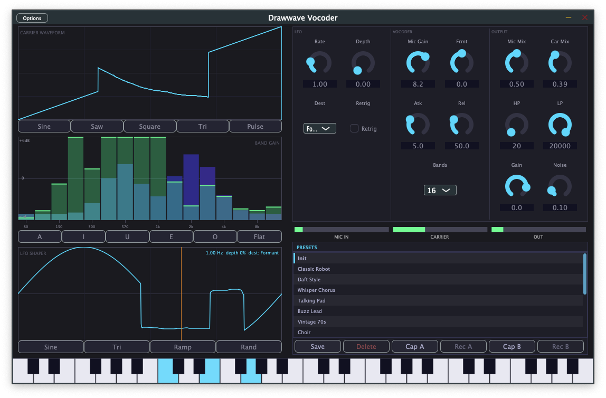

# Drawwave Vocoder

マウスで波形・カーブを「描いて」キャラクターを作り込むボコーダー VSTi プラグイン。



- **描けるキャリア波形** — 2048サンプルのウェーブテーブルをマウスで自由に描画（ミップマップ・アンチエイリアシング付き）
- **描けるバンドゲイン** — 16バンドのスペクトル整形をグラフィカルに編集、VUオーバーレイでリアルタイム確認
- **描ける LFO** — 変調波形も自由に描画、テンポ同期・Retrigger 対応
- すべての描画データをプリセット（`.dvoc`）として保存・呼び出し可能

## 動作環境

| OS | フォーマット |
|---|---|
| macOS 11 以降（Universal Binary x86_64 + arm64） | VST3 / AU / Standalone |
| Windows 10/11（x64、未検証） | VST3 / Standalone |

---

## 使い方・プリセット

詳細は **[docs/USAGE.md](docs/USAGE.md)** を参照してください。

---

## ビルド方法

**必要なもの**

- CMake 3.22 以上
- C++17 対応コンパイラ（Xcode 14+ / MSVC 2022 / GCC 11+）
- Ninja（推奨）

JUCE と nlohmann/json は [CPM.cmake](cmake/CPM.cmake) で自動取得されます。

```sh
git clone https://github.com/<your-org>/drawwave-vocoder.git
cd drawwave-vocoder

cmake -B build -G Ninja -DCMAKE_BUILD_TYPE=Release
cmake --build build --parallel
```

ビルド成果物は `build/DrawwaveVocoder_artefacts/` 以下に生成されます。

### macOS: プラグインのインストール

```sh
# VST3
cp -r build/DrawwaveVocoder_artefacts/VST3/DrawwaveVocoder.vst3 \
      ~/Library/Audio/Plug-Ins/VST3/

# AU
cp -r build/DrawwaveVocoder_artefacts/AU/DrawwaveVocoder.component \
      ~/Library/Audio/Plug-Ins/Components/
```

---

## ドキュメント

- [使い方・プリセット (docs/USAGE.md)](docs/USAGE.md) — 操作方法・各コントロール・音作りのヒント・プリセット解説
- [仕様書 (docs/SPEC.md)](docs/SPEC.md) — 設計コンセプト・DSP仕様・パラメーター一覧・実装状態

## ライセンス

GPL v3 — 詳細は [LICENSE](LICENSE) を参照。

本プロジェクトは以下のライブラリを使用しています：

- [JUCE](https://juce.com/) — JUCE Personal License / GPL v3
- [nlohmann/json](https://github.com/nlohmann/json) — MIT License
